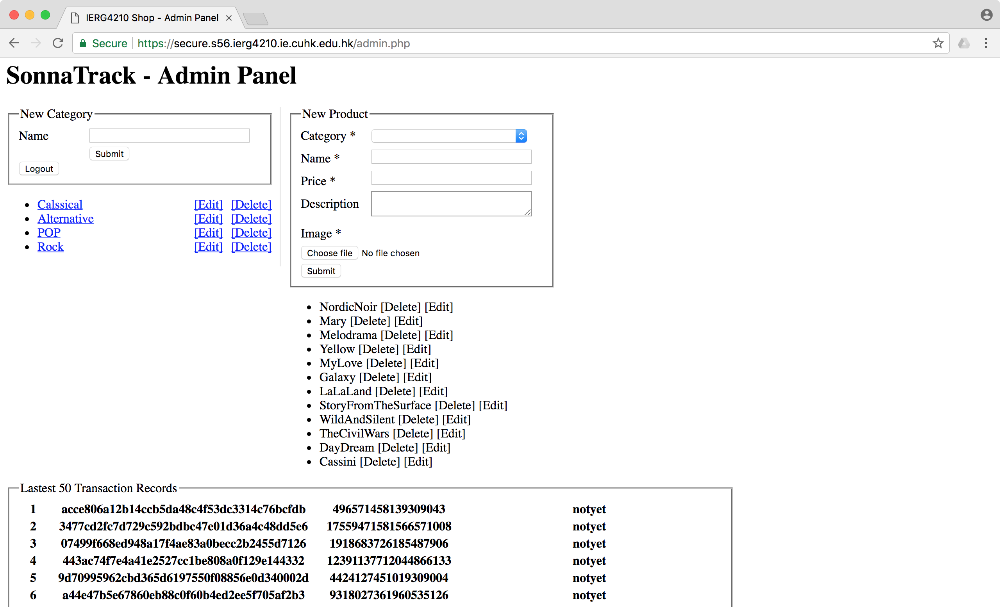

## Secure E-commerce Web Portal

#### IERG4210 Course Project 

> This is the course project of IERG4210 Web Programming and Security, which aims to build a secure e-commerce website from scratch. The design and implementation of this web portal have both considerations for functionality and security. 

> Check the online demo at: [SonnaTrack Store](https://ec2-52-196-12-38.ap-northeast-1.compute.amazonaws.com/index.php)

#### Features:

* Flexible product and user data management with SQLite
* AJAX shopping list with dynamic updating, reloading, and checking
* Loading optimization of the main page with several efficient AJAX panels
* Basic security defense against the following attacks:
  * No XSS injection and parameter tampering
    * Client-side form input restrictions
    * Server-side form input sanitizations and validations
    * Context-dependent output sanitizations
  * No SQL injection vulnerabilities
    * Parameterized SQL statement with PD0 library
  * No CSRF vulnerabilities
    * Secret nonce validation for each form
    * Tested through traditional login CSRF and other CSRF
* Session and token management for the admin/users
  * Cookies authentication in the admin panel and related libraries
  * No session fixation vulnerabilities (rotate session-id upon successful login)
  * Different user tokens to distinguish admin/normal users
  * Password retrieval by sending a hashed key through email
  * Logout function
* SSL certificate (90 days before expiration)
  * Force all traffic switching to HTTPS in admin/checkout/login panels
* Secure checkout flow connectin with PayPal's API
  * Sending the shopping cart AJAX instead of default form submission
    * Only sending the PID and quantity of each product to server
    * Server generated a digest message and store into DB
  * IPN listener and two-steps validation in the server-side
  * Transaction records are available for the admin and users

#### Components:

* Main page (header, product overview, categorical navigator, shopping cart)
* Product display page (detailed info, add to cart)
* Category page (product overview under a specific category)
* Admin panel (add/edit/delete products and manage transactions)
* Login and register panel (sign up/sign-in/retrieval password)

#### Extensions:

* All cookies are configured with Secure and HttpOnly flags
* Adopting AJAX to reduce rendering time of the home page
* Supporting secure password reset for users
  * A page for requesting a password reset through email
  * Validate email and generate a one-time nonce
  * Send nonce through email by URL rewriting
  * Only the person receiving his nonce can change his password
* Supporting password change
  * Validate the current user
  * Logout after changing password

#### Screenshots:

  

  

  

  

  

